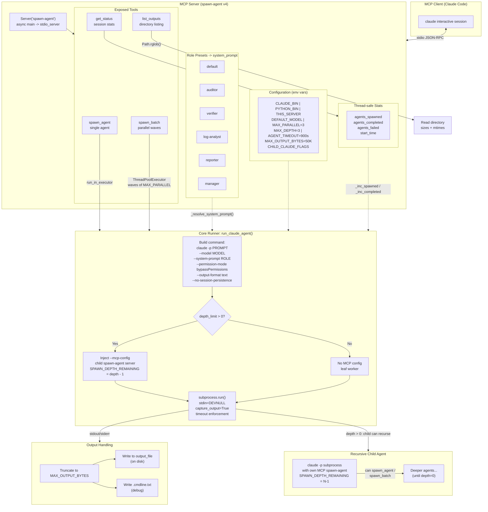
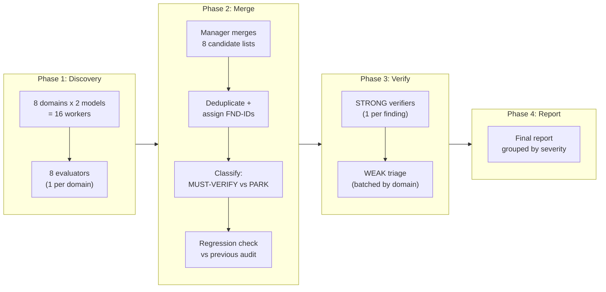

# Architecture

## MCP Spawn-Agent Server

The spawn-agent MCP server is the execution engine. It exposes four tools to Claude Code
and manages `claude -p` subprocesses with depth-limited recursion.

## Audit Pipeline Flow

The ensemble auditor prompt orchestrates 50+ agents across 5 phases:

## Phase Details

### Phase 1 — Dual-Model Discovery

Each of the 8 audit domains gets **two independent workers** — one running Sonnet, one running Opus.
This redundancy is intentional: different models notice different things.

Workers collect raw facts (command outputs, file contents) and flag anomalies as candidates
with STRONG or WEAK signals. They do NOT assign severity — that's the verifier's job.

**Domains:**

| # | Domain | What it checks |
|---|--------|----------------|
| 01 | Processes/Resources | Running processes, memory, OOM config, swap |
| 02 | Systemd | Failed units, boot performance, cron jobs |
| 03 | Network | Listening ports, firewall, DNS, routing |
| 04 | Storage | LUKS, SMART, filesystem health, mount config |
| 05 | System Config | GRUB, sysctl, kernel modules, PAM, sudoers |
| 06 | Software | Packages, repos, security updates, containers |
| 07 | Hardware/Users | Sensors, accounts, SSH keys, permissions |
| 08 | Logs | Journal, dmesg, auth logs, rotation status |

### Phase 1.5 — Domain Evaluators

After all 16 workers complete, **8 evaluator agents** (one per domain) analyze both workers'
outputs with a clean context window. They:

- Compare Sonnet and Opus findings for agreement/disagreement
- Look for cross-fact patterns (e.g., "OOM killed X" + "X was a screen locker" = security breach)
- Produce a ranked, deduplicated candidate list per domain

### Phase 2 — Manager Merge

The manager (the orchestrating Claude session) reads all 8 evaluator outputs and:

1. Deduplicates across domains
2. Assigns finding IDs (FND-001, FND-002, ...)
3. Classifies: MUST-VERIFY (STRONG, or WEAK from both models) vs PARK (WEAK from one model)
4. Runs regression check against the previous audit (if any)

### Phase 3 — Verification

Opus verifier agents check each STRONG finding against **runtime state**. They:

- Run targeted commands to confirm the issue exists
- Check for config-vs-runtime discrepancies
- Assign severity (CRITICAL/HIGH/MEDIUM/LOW/FALSE-POSITIVE)
- Provide a specific fix and rollback plan

### Phase 3.5 — Weak Triage

WEAK MUST-VERIFY findings get batch-verified: one agent per domain runs quick commands
to confirm or dismiss each finding.

### Final Report

The manager compiles everything into `report.md` with:

- Executive summary with severity counts
- Findings grouped by severity
- False positives with explanations
- Parked observations for future investigation
- Model coverage analysis (which model found what)
- Pipeline statistics

## Key Design Decisions

1. **Separation of concerns:** Workers collect, evaluators analyze, verifiers confirm.
   No single agent does everything.

2. **Dual-model redundancy:** Running Sonnet and Opus independently catches more issues
   than either model alone. In testing, ~15% of HIGH/CRITICAL findings were caught by
   only one model.

3. **Evaluator layer:** Prevents the manager from losing low-priority findings when
   merging 800+ facts. The evaluator sees only its domain's data with a clean context.

4. **File-based coordination:** All data flows through files on disk. This makes the
   pipeline resumable and debuggable — every agent's exact command line is recorded.

5. **Regression checking:** Comparing against previous audits prevents findings from
   being lost across runs due to model non-determinism.
